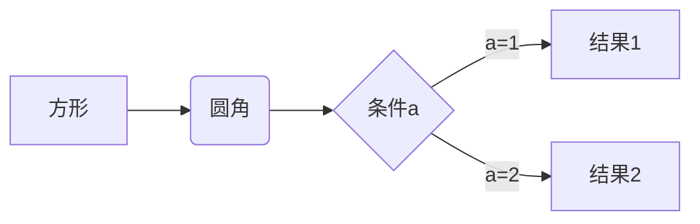

#### 请求头
|  字段   | 描述  |
|:--  |:-------  |
| Accept  | 指定客户端接收信息类型，如：image/jpg;text/html;aplication/json |
| Accept-Charet  | 客户端接收字符集，如gb2312, iso-8559-1 |
| Accept-Encoding  | 可接收的内容编码，如：gzip |
| Accept-Language  | 接收语言，zh-CN,zh;q=0.9 |
| Connection  | 单元格 |
| Content-Length  | 数据长度 |
| Content-Type  | 请求数据类型 |
| Host  | 主机ip或地址名 |
| Origin  | 单元格 |
| Referer  | 当前文档url,即从哪个链接过来 |
| Remote-Client  | 单元格 |
| User-Agent  | 客户端相关信息，如操作系统，浏览器等信息 |
| Cache-Control  | 缓存机制 |
| Pragma  | 防止页面被缓存，和Cache-Control:no-cache一样 |
| Authorization  | 客户端提供给服务端，进行权限认证的信息 |

#### 请求体

