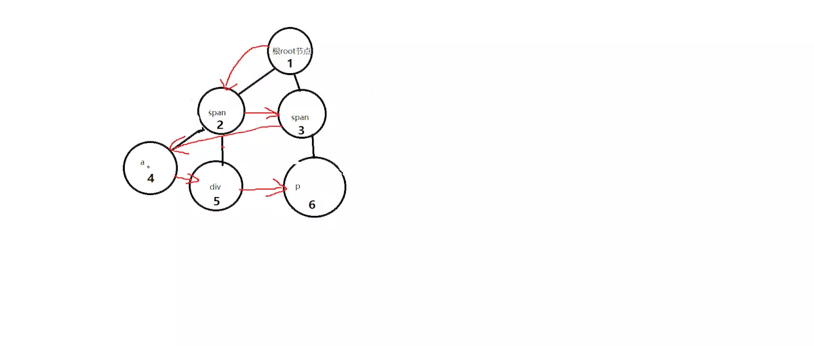
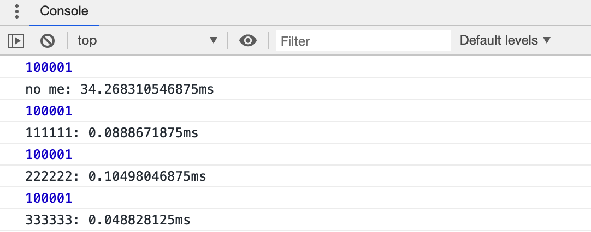

## 1. 构造函数和原型
#### 1.1 概述：
在典型的oop语言中，都存在类的概念，类就是对象的模板，对象就是类的实例，但是在es6（es2015之后的版本统称）之前，js中并没有引入类的概念

在es6之前，对象并不是通过类创建的，而是用一种称为构造函数的特殊函数来定义对象及特征

````javascript
function Test(){
    this.name = 'test';
    this.abbr = 'test'
}
let obj = new Test();
````

#### 1.2 构造函数的成员
###### 1.2.1 静态成员
>在构造函数本身添加的成员（只能通过构造函数来访问）

````javascript
Test.static = 'static';
console.log(obj.static);//undefined
````

###### 1.2.2 实例成员
>构造函数中通过this添加的成员（只能通过实例化的对象来访问）

````javascript
console.log(obj.name);//test
````

#### 1.3 构造函数和原型
###### 1.3.1 构造函数的原型 prototype

>构造函数通过原型分配的函数hi所有对象所共享的 (一般用于存放公共的东西)
>javascript规定每一个构造函数都有一个prototype属性，指向另一个对象。这个对象的所有属性和方法都会被构造函数所拥有

````javascript
Test.prototype.share = 'share';
console.log(obj.share);//share
console.log(obj.__proto__===Test.prototype)//true

````
###### 1.3.2 constructor
>对象原型（__proto__）和构造函数原型对象(prototype）里面都有一个constructor属性,被称之为构造函数，因为它指回构造函数本身（用于记录引用了哪个构造函数，可用于原型对象指回构造函数本身）

````javascript
Test.prototype ={
    common:'common',
    constructor:Test//指回构造函数本身
}
````

###### 1.3.3 原型链
>多个原型组成链状结构的现象

1. 成员查找规则
   >按照原型链的规则查找
        首先查找对象本身
        然后查找它的原型
        然后查找Object的原型
        依此类推一直查找到Object为止
        
###### 1.3.4 继承
>es6之前没有提供extends继承，通过构造函数+原型对象模拟实现继承，被称为组合继承

````javascript
function Father(name,age){
    this.name = name||'';
    this.age = age||''
}

Father.prototype.makeMony = function(){
    console.log(10000)
}

function Son(name,age){
    Father.call(this,name,age);//继承属性
}

Son.prototype = new Father();//继承原型
Son.prototype.constructor = Son;

let son = new Son('张三','25');
console.log(son.name,son.age)//张三，25
````
## 2. 截流和防抖

#### 2.1 截流
>触发高频事件后n秒内函数只会执行一次，如果n秒内高频事件再次被触发，则重新计算时间

原理：每次触发事件时都取消之前的延时调用方法

````javascript
function debounce(fn){
    let timeout = null;
    return function(){
        clearTimeout(timeout);
        timeout = setTimeout(()=>{
            fn.apply(this,arguments);//根据this指向的相关规则  这里将this指回调用fn的上下文
        },300)
    }
}
````

#### 2.2 防抖
>高频事件触发，但在n秒内只会执行一次，所以节流会稀释函数的执行频率

原理：每次触发事件时都判断当前是否有等待执行的延时函数
  
````javascript
function throttle(fn){
    let canRun = true;
    return function(){
        if(!canRun){
            return
        }
        canRun = false;
        setTimeout(()=>{
            fn.apply(this,arguments)
        },300)
    }
}
````

## 3. 深度优先遍历及广度优先遍历

#### 3.1 深度优先遍历(Depth First Search)的主要思想是
>1、首先以一个未被访问过的顶点作为起始顶点，沿当前顶点的边走到未访问过的顶点；

>2、当没有未访问过的顶点时，则回到上一个顶点，继续试探别的顶点，直至所有的顶点都被访问过。

网上有一句话很贴切（不到南墙不回头）

 


````javascript
let orgTree=[
    {
        id:'test',
        name:'众康云医院',
        children:[
            {
                id:'test2',
                name:'心血管科室',
                children:[{
                    id:'test3',
                    name:'test3'
                }]
            }
        ]
    },
    {
        id:'dadad',
        name:'江北医院'
    }
];
//方式1 递归方式
function deepTraversal(tree){
    if(!tree||!tree.length){
        return []
    }
    let arr = [];
    for(let i=0;i<tree.length;i++){
        let item = tree[i];
        let obj={
            id:item.id,
            name:item.name
        }
        arr.push(obj);
        if(item.children&&item.children.length){
            arr.push(...deepTraversal(item.children))
        }
    }
    return arr
}

//方式2 非递归方式
function deepTraversal(tree){
    if(!tree){
        return []
    }
    let arr = [];
    let stack = [];
    for(let i=0;i<tree.length;i++){
        let item = tree[i];
        stack.push(item);
        while(stack.length){
            let stackItem = stack.pop();
            arr.push({
                id:stackItem.id,
                name: stackItem.name
            });
            let children = stackItem.children||[];
            if(children.length){
                for(let c = children.length-1;c>=0;c--){
                    stack.push(children[c])
                }
            }
        }
    }
    return arr
}
````
#### 3.2
>广度优先遍历(Breadth-First-Search)的主要思想是：类似于树的层序遍历。



````javascript
function wideTraversal(tree){
    let arr=[];
    let queue=[];
    queue.unshift(...tree);
    while(queue.length){
        let queueItem = queue.shift();
        arr.push({
            id:queueItem.id,
            name: queueItem.name
        });
        let children = queueItem.children||[];
        if(children.length){
            for(let c =0; c<children.length;c++){
                queue.push(children[c])
            }
        }
    }
    return arr;
}

````

## 4. 函数式编程--柯理化
>在数学和计算机科学中，柯理化式一种将多个参数的一个函数转换成一系列可以使用一个参数的函数的技术。

#### 4.1 前端为什么使用柯理化？
>简化代码结构，提高系统的可维护性，一个方法，只有一个参数，强制了功能的单一性，很自然的做到了功能内聚，降低耦合。

总结：减少重复代码，提高代码适应性

````javascript
//1.初始化一个要求你下一次将参数传完的函数 (fixedFunction)
//2.初始化每次调用检查参数是否已经累计传完的函数（fixArgs）
//3.如果本次调用检查到参数没传完，那么返回一个下一次期待你传完的函数

function curry(fn){
    function fixedFunction(fuc){
        let args = [].slice.call(arguments,1);//获取当前传入的参数个数
        return function(){
            let currentArgs = args.concat([].slice.call(arguments,0))//组装所需要的参数
            return fuc.apply(this,currentArgs)
        }
    }
    function fixArgs(fn,length){
        let len = length||fn.length;
        return function(){
            if(arguments.length<len){
                let com = [fn].concat([].slice.call(arguments,0));
                let reset = fixedFunction.apply(this,com);
                return fixArgs.apply(this,[reset,len-arguments.length]);
            }else{
                return fn.apply(this,arguments)
            }
        }
    }

    return fixArgs(fn)
}


function test(a,b,c){
    return a+b+c
}

let cuTest = curry(test);

let test1 = cuTest(3);
console.log(test1(2,10))
console.log(test1(2)(2))
````

## 5. 函数性能优化

#### 5.1 惰性函数
>函数的分之语句在函数首次调用的时候执行，之后的调用不再执行分之语句，直接进入函数首次调用的分之

````javascript
function test(){
    var a = 'test';
    console.log(a);
    test = function(){
        console.log(`a的值是:${a}`)
    }
    test()
}

test()// test, a的值是:test
test()// a的值是:test
test()// a的值是:test
test()// a的值是:test
````

#### 5.2 函数记忆
>缓存曾经计算过的数据，如果数据存在，返回已存在数据，如果不存在，计算并缓存

````javascript
function memorise(fn){
    let cache={}
    return function(){
        let key = arguments.length+[].join.call(arguments);
        if(cache[key]){
            return cache[key]
        }else{
            cache[key] = fn.apply(this,arguments);
            return cache[key]
        }
    }
}
function test(){
    let t = 1;
    for(let i = 0;i<100000;i++){
        t++
    }
    return t
}
let newTest = memorise(test);

console.time('no me')
console.log(newTest())
console.timeEnd('no me')

console.time('111111')
console.log(newTest())
console.timeEnd('111111')

console.time('222222')
console.log(newTest())
console.timeEnd('222222')

console.time('333333')
console.log(newTest())
console.timeEnd('333333')
````
